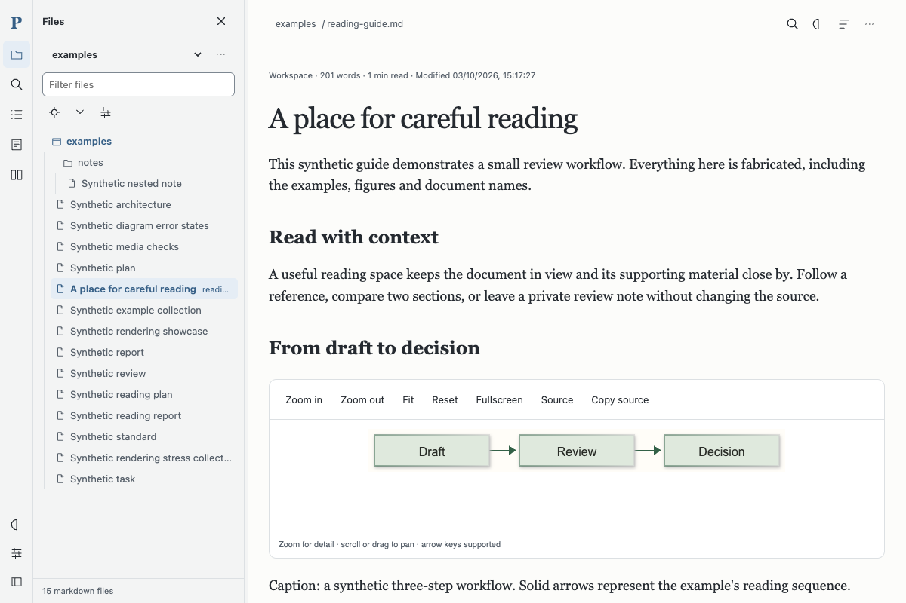
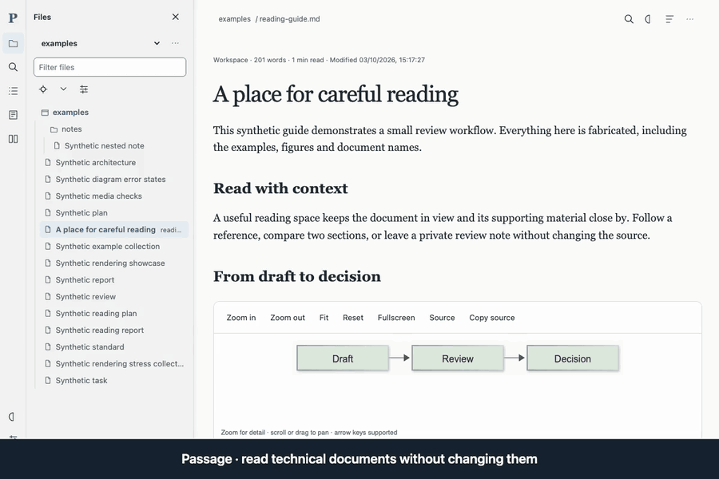

# Passage

A local, read-only Markdown reader for engineers, reviewers and anyone navigating a folder of technical documents.



[](https://github.com/venkatakgonela/passage/actions/workflows/checks.yml)

## Why Passage

- Read locally, without accounts or editing source documents.
- Follow references, peek at sections and return to your place.
- Read diagrams and math through sanitized, isolated rendering paths.
- Compare sections and save notes separately from their source.

## 60-second quick start

**Requirements:** Python 3.9+ and a modern Chromium, Firefox or Safari browser. Prefer a maintained Python release: 3.9 is end-of-life. No runtime packages, Node or build step required.

1. **Get the code.** Clone the repository:

   ```sh
   git clone https://github.com/venkatakgonela/passage.git
   cd passage
   ```

   Or choose **Code → Download ZIP**, extract it, and open a terminal in the extracted folder.

2. **Start the reader:**

   ```sh
   python3 -m server
   ```

   On Windows use `py -m server`. If Make is installed, `make run` is a shortcut. Leave this terminal open; Ctrl+C stops the reader.

   If the address is already in use, run `python3 -m server --port 0` (Windows: `py -m server --port 0`) to select a free port.

3. **Open the printed address** in your browser. You'll see the synthetic example collection and Files panel. Open `reading-guide.md` for a first tour.

For your documents, use `python3 -m server --root "/path/to/documents"` (Windows: `py -m server --root "C:\Documents"`), or **Files → workspace … → Add folder**. Choose a folder separate from the reader's settings.

> **Good to know:** trusted local use only. The server binds only to loopback, never an Internet-facing address; don't tunnel or proxy it. It never edits source documents. Local images support PNG/JPEG only. Settings live in `$XDG_CONFIG_HOME/passage` or `~/.config/passage`; remote images can contact external servers. See the [reference](docs/reference.md) for overrides and limits.

Tested: macOS with Python 3.9/3.14 and Chrome; Linux CI with Python 3.12. This tour uses Chrome 154. Firefox/Safari and Windows are untested; Windows is expected to work with the standard-library runtime—please report problems.

## Learn the reader

[Ten-minute tutorial](docs/getting-started.md) · [Captioned demo video](docs/media/passage-demo.mp4) · [Docs index](docs/index.md) · [Keyboard map](docs/reference.md#keyboard-map) · [Security](SECURITY.md) · [Contributing](CONTRIBUTING.md)



The demo is an edited, silent 60-second tour of real browser states. [Regenerate the media](docs/media.md). Version 0.1.1; see the [release notes](CHANGELOG.md).
