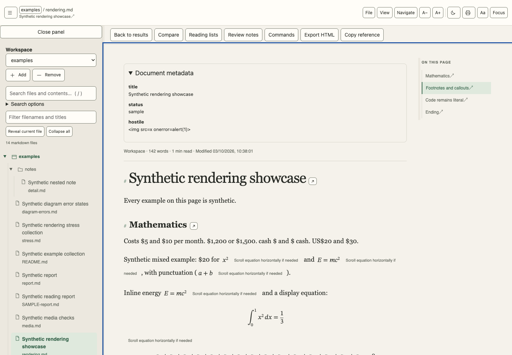
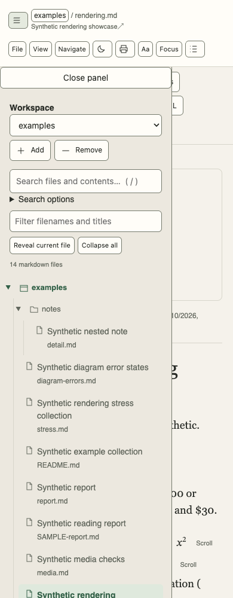

# Passage

A local, read-only Markdown reader for technical documents. Follow references, compare related sections and return to your place without editing the source or creating an account.

## Run

Requires Python 3.9+. No runtime package installation or build step.

```sh
make run
make run ARGS="--root /path/to/documents --port 8765"
```

Open `http://127.0.0.1:8765`. Repeat `--root` for multiple startup folders; Ctrl+C stops the server. Default content is [synthetic examples](examples/README.md). This source distribution has not been published to a package registry.

## Demo

Open `rendering.md` for equations, footnotes and callouts. Follow the Chain from `SAMPLE-plan.md` to its report, compare Evidence sections, add a reading-list reference and export a local note. Commands lists reader controls.





These browser-generated images contain only synthetic examples, including deliberately hostile text displayed inertly to demonstrate escaping.
At narrow widths the existing sidebar drawer overlays part of the document; close it to read the full width.

## Find and follow

The workspace tree offers natural filename/modified sorting, title filtering, breadcrumbs, reveal/collapse and resizable panels. Quick open, history, return Trail, recents/pins, session restore and live refresh preserve context. Position restoration tries heading, snippet, then offset; edits can require an approximate fallback. Peek is a resource-free section preview, not a full second reader.

Search scopes include workspace, current folder/descendants and current document. Terms use AND matching unless Exact phrase is enabled; case and whole-word options are available. Ranking prioritizes filename matches, content count, then path. Results survive visits via Back to results. Search scans sorted eligible files up to 5,000, retaining a 16 MiB byte budget and 60-hit cap. “Scanned N of M files” and truncation expose incomplete coverage. Enumeration stops after 10,000 filesystem entries; totals describe enumerated eligible files, not an uncapped census.

Chain recognizes same-folder `PREFIX-kind.md` families and simple front-matter `related: [file.md, other.md]` or an indented dash list. It reads up to 20 heads of 16 KiB for status/verdict chips. Parent traversal is refused. Compare uses complete sanitized documents, normalized heading text/occurrence matching and proportional fallback. Narrow panes stack with a section selector. This is not a semantic text diff.

## Render and export

Tables/code scroll locally with hints and keyboard focus. Flowchart/sequence/ER diagrams have isolated output, zoom/pan, source and fullscreen. Local PNG/JPEG images are bounded; SVG/GIF/WebP remain unsupported. Appearance offers light/dark/auto, serif/sans, text size, reading measure and focus mode.

Math uses `$inline$` or `$$display$$`, with lazy vendored KaTeX producing native MathML and no remote fonts. Limits: 200 expressions, 4,000 characters each, 100 expansions and size 20. Resource/definition commands are refused; invalid/unavailable math shows source. Browser math appearance varies. These are not hard CPU timeouts.
Inline opening dollars require a non-space, non-digit next character; closing dollars require a non-space preceding character and no following digit. Thus `$5 and $10` stays prose, while `$x^2$` renders. Numeric-leading equations need display delimiters or a nonnumeric TeX prefix. Code spans and fences remain literal.

Footnotes use `[^key]` and single-line `[^key]: text`, with repeated-reference backlinks. Bodies are escaped plain text, not nested Markdown. Blockquote callouts support `[!NOTE]`, `[!TIP]`, `[!WARNING]`, `[!IMPORTANT]`, `[!CAUTION]`. Native details/summary are styled. Leading front matter becomes a collapsible escaped key/value panel, limited to 16 KiB/100 lines; complex YAML is not interpreted.

Copy heading link and Copy reference produce Markdown file/heading references, optionally including selection. Export HTML downloads a self-contained sanitized file capped at 8 MiB. Trusted styles and eligible local PNG/JPEG images are embedded; remote/oversized images are omitted. Sandboxed diagrams become explicit source placeholders rather than weakening isolation. No scripts, remote resources, settings or server write destination are exported. Print/PDF remain native; wide tables and large diagrams may be too small in print.

## Lists, notes and recovery

Lists support create/rename/delete, add section, keyboard reorder, remove and jump. Notes capture heading/snippet/offset without source edits. Missing files and current-document orphan anchors stay listed; other-document anchors are checked when opened. Selected notes export as copyable Markdown, without AI.

Review settings are local unencrypted per-root JSON: 20 lists, 200 references, 200 notes, 4,000 characters per note, 256 KiB total. Atomic replacement preserves previous bytes on failure; stale revisions require reopening/retry. One server process is supported. Corrupt settings can explicitly be moved aside and reset, retaining original bytes in a sibling backup. Valid settings are not reset.

Server/document failures show an explanation and Retry or another-workspace guidance. Storage failure shows a notice; reading works but preferences may not persist. No automatic backup or synchronization is provided.

## Safety

IPv4 loopback only. Browsing authority is resolved home plus explicit startup roots; outside-home roots must be supplied at every launch. Markdown paths reject traversal, symlinks, skipped directories and non-`.md` suffixes. Reads are capped at 2 MiB. Metadata reads at most 16 KiB and uses a locked bounded cache. Large roots still cost enumeration/stat work.

Host and supplied Origin are checked on all routes. Writes require Origin exactly matching Host and same-origin Fetch Metadata when supplied. Source documents never change; reader-owned settings are writable outside displayed roots. Defaults are `roots.json` and `reviews-*.json` under `$XDG_CONFIG_HOME/passage` (absolute XDG paths only), otherwise `~/.config/passage`. `READER_SETTINGS` overrides the roots filename, with reviews alongside it, and bypasses migration. A folder enclosing the settings directory cannot be registered; choose a narrower folder or relocate settings outside it.

On first default startup, legacy checkout `.state/roots.json` and `reviews-*.json` are copied without overwriting destination files or deleting originals. Symlink sources are skipped. A `.legacy-migrated` marker prevents repeated copying; failures abort startup and can be retried. Copies are private temporary files linked into place only when complete. Defaults are shared across checkouts: use an explicit override for separate instances. Settings and migration markers must remain untracked. See [settings decision](docs/decisions/0009-user-settings.md).

Folder removal and corrupt-review reset use in-page confirmations: Cancel or Escape leaves state unchanged, Tab stays inside the confirmation and closing restores focus. Browse/add/remove/reset errors appear beside their action, rather than in native alert boxes. Migration I/O failures appear in the startup terminal, before the reader opens.

Markdown and generated math pass through DOMPurify; diagram frames have no permissions. This is a trusted-local reader, not an Internet server, hostile-filesystem sandbox or offline firewall: remote images in the live reader may contact external servers. Export omits them. See [security](SECURITY.md), [threat model/tests](docs/ARCHITECTURE.md), [known limits](docs/known-rendering-issues.md), [third-party notices](THIRD-PARTY-NOTICES.md).

## Keyboard map

| Action | Shortcut |
| --- | --- |
| Commands | Ctrl/Cmd+K; type, arrows, Enter |
| Quick open | Ctrl/Cmd+P |
| Search/reveal sidebar | `/` outside inputs |
| Document find | Ctrl/Cmd+F in reading pane |
| Next/previous find result | Enter / Shift+Enter in find input |
| Trail return | Alt+Left in reading pane |
| Toggle documents | `b` outside inputs |
| Close dialog/drawer | Escape |
| Activate controls | Tab, then Enter/Space as appropriate |
| Resize focused separator | Arrows, Home/End |
| Pan focused diagram | Arrows |

Actions without direct shortcuts use labelled controls or Commands. File/View/Navigate open their menus. Accessibility checks cover landmarks, labels, keyboard flows, focus return, reduced motion and measured palette contrast—not screen-reader certification.

## Documentation

See the [documentation index](docs/index.md) for a reading order.

## Development and release checks

```sh
npm ci --ignore-scripts
make test
make lint
make test-browser
python3 tools/pre-publish-check
```

Tests need Node 22+ and installed Chrome (`BROWSER_EXECUTABLE` override). No browser download. Browser tests copy synthetic examples into temporary workspaces, test 1440/1024/390px in both themes and exercise interactions. `READER_EVIDENCE` saves logs/screenshots. `READER_PUBLIC_IMAGES=1` explicitly regenerates demo pictures. `node tests/performance.mjs` measures a disposable 2,003-file workspace.

The release checker scans tracked tree/full reachable history for private identifiers/paths, secret patterns, oversized files, identity, licence and link coverage. Upstream vendor provenance is an explicit exception. Passing checks do not publish, tag, prove hosted CI or certify security. [Contributing](CONTRIBUTING.md) · [Decisions](docs/decisions/README.md) · [Changelog](CHANGELOG.md) · [MIT licence](LICENSE).
