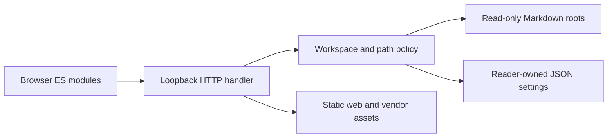
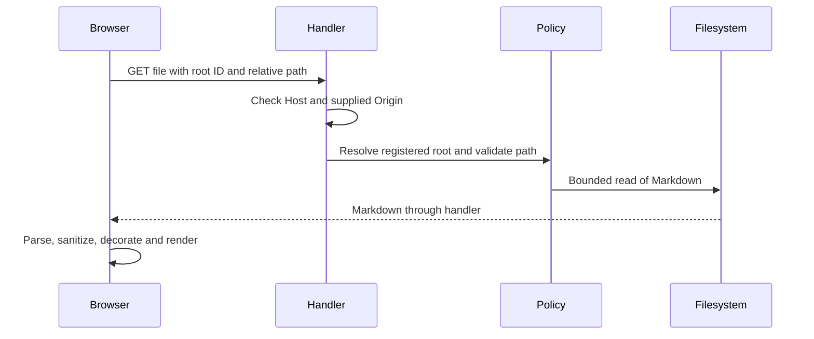
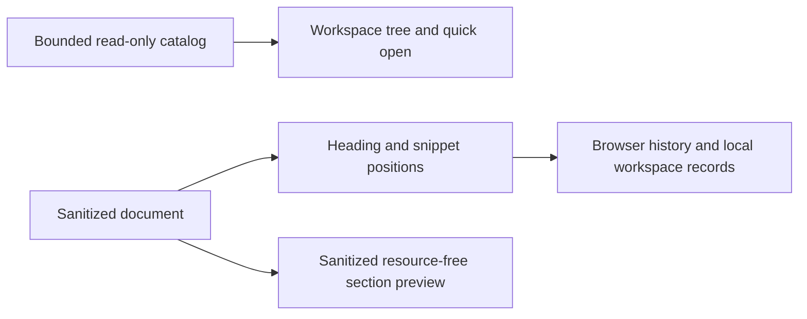

# Architecture

## Implemented: overview

One loopback Python HTTP process serves a static browser application and read-only Markdown APIs. The browser renders sanitized HTML and keeps preferences in localStorage. Reader settings persist registered paths separately from documents. There is no database, hosted service, build pipeline or document-write API.

Caption: implemented component boundaries. Legend: solid arrows are implemented calls; only the settings arrow permits writes.

Caption: implemented document request flow. Legend: solid calls and dashed responses describe existing behaviour, not future components.

## Implemented: responsibilities and technology

| Component | Responsibility / choice | Trade-off |
| --- | --- | --- |
| [HTTP](../server/http.py) | stdlib HTTP routing, exact request guards, explicit static MIME types | Suitable for a trusted local reader, not a production Internet server |
| [Policy](../server/policy.py) | canonical boundaries, caps, root state and settings | Path resolution is not race-proof against a malicious local filesystem actor |
| [Entry point](../server/__main__.py) | CLI roots/port and environment-selected settings | A startup root is an intentional filesystem capability |
| [State](../web/state.js), [workspace](../web/workspace.js) | browser preference storage and picker lifecycle | No shared account or synchronization |
| [Tree](../web/tree.js), [search](../web/search.js) | folder rendering and asynchronous search | No natural-sort controls or contextual search tree |
| [Rendering](../web/rendering.js), [paths](../web/paths.js) | marked, DOMPurify, highlight.js and local link/slug handling | Preserved renderer limitations and pinned older vendor versions |
| [Navigation](../web/navigation.js), [theme](../web/theme.js) | keyboard, hash navigation, theme, font, print | Section positions are not restored |
| [Configuration](../web/config.js) | one display-name/storage-prefix source | Documentation titles remain static text |
| [Tests](../tests/test_server.py) | unittest and node:test without dependencies | Real-browser layout and clipboard/print behaviour require browser verification |

## Implemented: threat model

Assets: displayed Markdown contents, local directory metadata, reader settings and browser execution context. Actors: the local user, a remote site attempting cross-origin/rebinding requests, malicious Markdown, and local processes. Trust boundaries: HTTP request to handler, root-relative path to filesystem, Markdown to DOM, and reader-owned settings to source documents.

| Invariant / mitigation | Regression evidence |
| --- | --- |
| Bind only to IPv4 loopback | `ServerTests.test_loopback_binding` in [server tests](../tests/test_server.py) |
| Reject unapproved Host and supplied Origin; require Origin for writes | `test_host_and_origin_matrix`, `test_duplicate_headers_rejected` |
| Reject absolute/traversing paths and non-public static files | `test_paths_and_static_boundary` |
| Reject symlink and skipped-folder reads consistently | `test_symlink_and_skipped_paths` |
| Bound Markdown and request-body reads, results and browse listings | `test_file_size_boundary_and_search`, `test_bad_request_bodies`, `test_search_and_file_caps`, `test_browse_and_registration_boundaries` |
| Enforce resolved home/startup boundaries; saved state cannot expand them | `test_browse_and_registration_boundaries`, `test_persistence_cannot_expand_boundaries` |
| Never write displayed source documents | `test_documents_remain_unchanged` |
| Treat prototype-shaped names as data; escape search output | [logic tests](../tests/logic.test.js): prototype and highlighting cases |
| Namespace preferences and tolerate inaccessible browser storage | [logic tests](../tests/logic.test.js): storage case |

Markdown sanitization occurs immediately before DOM insertion. Browser checks exercise hostile synthetic markup; this is not a proof against all sanitizer bypasses. Remote/data images retain the existing treatment; remote images can disclose network metadata. Local PNG/JPEG references use the bounded image routes described below.

Residual risks: broad home enumeration by a trusted same-origin client, concurrent filesystem replacement between validation and open, concurrent settings mutations, slow/large directory traversal, and up to 5,000 bounded file reads per search. Caps limit returned counts and individual bytes, not total execution time or memory in directory enumeration. The HTTP server is not hardened for exposure beyond loopback. Local processes can impersonate HTTP headers and are outside the remote-site protection model.

## Implemented: reading and media

The editorial tokens in `web/styles.css` define surfaces, text, essential control boundaries and focus independently. `appearance.js` validates/persists reading preferences. `layout.js` preserves visible anchors around synchronous geometry changes; image frames reserve height before async loads. `media.js` handles validated local raster metadata and enlargement. `diagrams.js` lazy-loads the pinned renderer and places its generated output in an opaque-origin, no-permissions frame. See [image ADR](decisions/0002-raster-image-boundary.md) and [diagram ADR](decisions/0003-isolated-diagrams.md).

GET `/api/image` and `/api/image-info` are the new read-only routes. Both share type/signature/size/dimension/confinement checks in `server/images.py`; Host, Origin, Fetch Metadata and nosniff remain centralized. `ImageTests` pins these boundaries and image immutability. The browser suite pins real scroll containment, heading clearance, isolated diagram output, error/source states, image enlargement, native fragment history, focus/drawers and measured theme contrasts. `reading.test.js` pins input limits, preference validation and fragment encoding.

Image contract tests in `tests/test_images.py` separately enforce `test_png_trailing_bytes_rejected`, `test_png_without_idat_rejected`, `test_jpeg_without_end_marker_rejected`, `test_png_response_mime_and_bytes`, `test_jpeg_response_mime_and_bytes` and `test_image_info_returns_metadata_json`. Malformed cases exercise both routes, while successful metadata is decoded and compared with known dimensions/type. Header checks are still not full image decoding.

The diagram policy recognizes newline/semicolon statement boundaries outside quoted or bracketed labels, skips ordinary comments, and distinguishes sequence message text from commands. It rejects leading front matter, configuration directives, click/link/style statements and image/icon resource attributes without globally banning ordinary words or URLs. Node tests cover indented directives, semicolon directives and directive-like node names; the browser asserts those same accepted architecture fixtures reach ready frames, including a hostile label whose active markup is stripped and surrounding text remains. Frame permissions and CSP are unchanged.

This small scanner is not the Mermaid grammar: it tracks double-quoted strings and bracket depth, distinguishing ER cardinality braces from attribute groups and rejecting unfinished quotes/groups. Tests cover ER relationships in both directions, attributes and later prohibited styles. Unquoted pipe-delimited edge labels containing statement separators may still be treated as statements; unusual syntax should be quoted or reported for a targeted regression. Filter acceptance does not guarantee parser acceptance. The sandbox/CSP, not the filter, isolates output. Renderer work still executes in the parent; stale document completion is discarded but queued/in-progress diagram work is not cancelled (see backlog). No hard CPU/time isolation is claimed.

## Implemented: orientation and continuity

`server/catalog.py` provides paged stat/title metadata, reusing `policy.markdown_target` with exact request guards. `/api/files` remains compatible. `CatalogTests` enforces Host/Origin/Fetch Metadata/nosniff, symlink/skipped-path/confinement, title prefix, size/page/file caps, cache invalidation and source immutability. The catalog is read-only and cache-bounded; see [decision 0004](decisions/0004-bounded-catalog.md).

`orientation.js` and the existing tree/workspace modules implement menus, breadcrumbs, filters and panel sizing. `continuity-model.js` owns pure ordering/filter/fuzzy/storage/position logic; `session.js` persists validated per-workspace records; `continuity.js` integrates browser history, trail, quick open and visibility-gated polling. `reading-tools.js` creates sanitized inert section previews and reversible text-node find marks. [Decision 0005](decisions/0005-reader-continuity.md) records alternatives and fallback limitations.

Caption: implemented orientation and navigation data flow. Legend: arrows are in-memory/read-only transfers; only browser storage records change, never source documents.

Pure model tests pin natural sort, filter paths, fuzzy caps, validated storage, bounded trail and position fallback order. The browser suite preserves the original 66-case rendering matrix and exercises six theme/viewport configurations for keyboard menus/tree/reveal, breadcrumbs, quick open, trail return, section Peek, find, reload, modified synthetic files and missing-file fallback. Tests copy examples to an OS temporary root before changing them. Controls reuse measured contrast/focus tokens. No operating-system launching or new HTML execution boundary is added.

Print is native browser printing, not an export feature. Wide tables wrap at 6pt with repeated headers; 12-column print readability remains a stated limitation. Large diagrams fit a bounded frame and may have tiny labels. See [rendering checklist](known-rendering-issues.md).

## Planned / rejected

GET requests explicitly marked `Sec-Fetch-Site: cross-site` are rejected as defence in depth (`test_fetch_metadata`). Missing metadata remains valid for local clients. `same-site` can include unrelated applications on other localhost ports, so Host and Origin remain the primary guards, not Fetch Metadata. Static suffix filtering, nosniff responses and failed-settings-save rollback are pinned by `test_static_suffix_whitelist`, `test_nosniff_responses` and `test_settings_save_failure_rolls_back_registration`.

SVG/GIF/WebP, dedicated footnotes/callouts/front matter, stronger layout CPU isolation and broader navigation remain planned or deferred. A framework, bundler, database and document editing remain rejected for this scope. No future component is shown as implemented in the diagrams.
