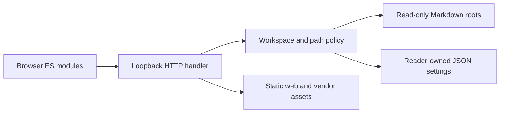
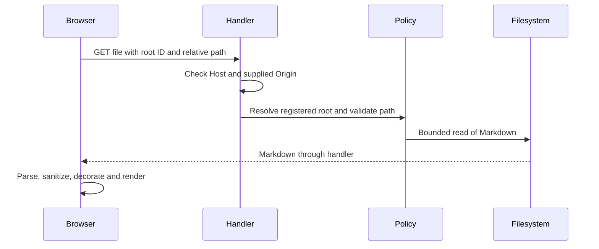
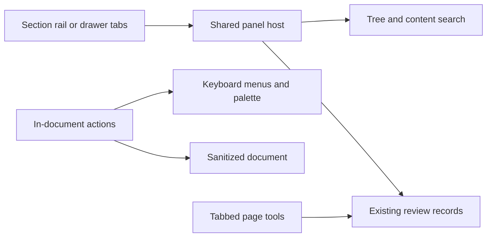
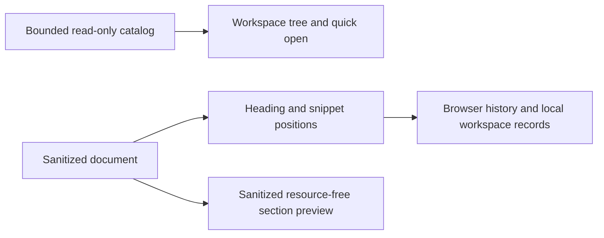
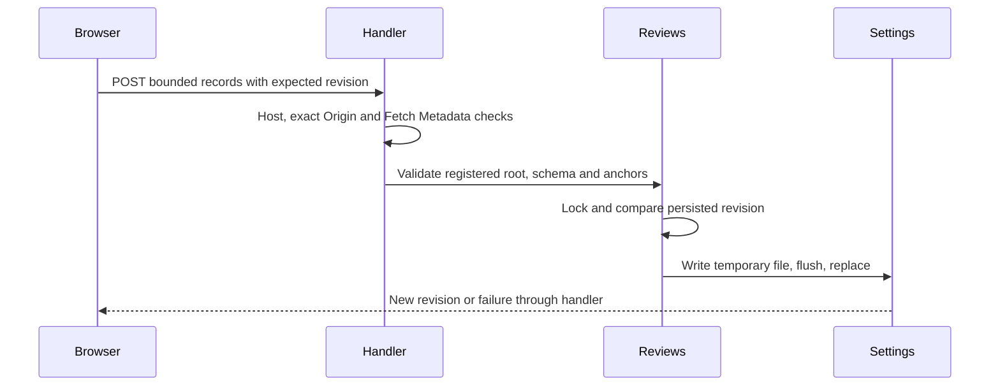
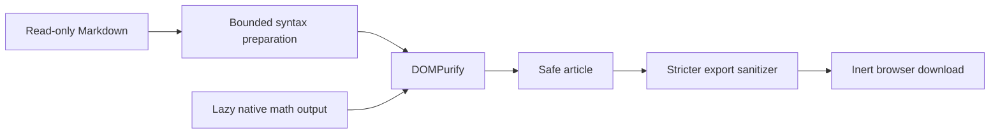

# Architecture

## Implemented: overview

One loopback Python HTTP process serves a static browser application and read-only Markdown APIs. The browser renders sanitized HTML and keeps preferences in localStorage. Reader settings persist registered paths separately from documents. There is no database, hosted service, build pipeline or document-write API.

Caption: implemented component boundaries. Legend: solid arrows are implemented calls; only the settings arrow permits writes.

Caption: implemented document request flow. Legend: solid calls and dashed responses describe existing behaviour, not future components.

## Implemented: responsibilities and technology

The [shell](../web/shell.js) composes existing controls into a section rail, reusable panel hosts and an in-document page header. It owns panel visibility, drawer keyboard handling, remembered labels and focus-header geometry; existing modules still own navigation, search, review records and rendering. [Shell CSS](../web/shell.css) provides neutral chrome and responsive layout. [ADR 0010](decisions/0010-reading-shell.md) records alternatives and compatibility changes.

Caption: implemented shell composition. Legend: solid arrows are existing UI calls; no source-write route is introduced.

| Behavior / boundary | Regression evidence |
| --- | --- |
| Six-width chrome, compact rows, one filter, menu keys, panel access and roving tree focus | [chrome browser tests](../tests/chrome-browser.mjs) |
| Focus hides side chrome; overlay does not move the heading; focused actions stay on screen | Chrome browser tests, existing anchor/refresh browser assertions |
| Browse eligibility uses registration policy and retains Host/Origin/Fetch Metadata checks | [shell policy tests](../tests/test_shell.py) |
| Currency inline helper suppression and overflow-only display hints | [release browser tests](../tests/release-browser.mjs) |
| Public images use isolated state and exclude attack fixtures/stale controls | `publicScreenshots` in chrome browser tests |

| Component | Responsibility / choice | Trade-off |
| --- | --- | --- |
| [HTTP](../server/http.py) | stdlib HTTP routing, exact request guards, explicit static MIME types | Suitable for a trusted local reader, not a production Internet server |
| [Policy](../server/policy.py) | canonical boundaries, caps, root state and settings | Path resolution is not race-proof against a malicious local filesystem actor |
| [Entry point](../server/__main__.py) | CLI roots/port and environment-selected settings | A startup root is an intentional filesystem capability |
| [State](../web/state.js), [workspace](../web/workspace.js) | browser preference storage and picker lifecycle | No shared account or synchronization |
| [Tree](../web/tree.js), [search](../web/search.js) | natural/modified sorting, folder rendering and bounded scoped search | No persistent search index |
| [Rendering](../web/rendering.js), [paths](../web/paths.js) | marked, DOMPurify, highlight.js and local link/slug handling | Preserved renderer limitations and pinned older vendor versions |
| [Navigation](../web/navigation.js), [theme](../web/theme.js) | keyboard, hash navigation, theme, font, print | Position restoration after edits is best-effort |
| [Configuration](../web/config.js) | one display-name/storage-prefix source | Documentation titles remain static text |
| [Tests](../tests/test_server.py) | unittest and node:test without dependencies | Real-browser layout and clipboard/print behaviour require browser verification |

## Implemented: threat model

Default startup resolves user-scoped settings and performs a non-overwriting legacy copy before constructing the workspace. Explicit overrides bypass copying. [ADR 0009](decisions/0009-user-settings.md) records location compatibility and migration limits; [settings](../server/settings.py) uses streamed temporary copies and exclusive hard links. Settings stay outside registered document roots. The browser's [dialog helper](../web/dialogs.js) uses the existing modal lifecycle and text-only action status, with no new rendering injection path.

| Invariant / behavior | Regression evidence |
| --- | --- |
| Default outside checkout; refuse roots enclosing settings; preserve originals and existing targets; copy once | `test_default_location_and_one_time_non_destructive_migration`, `test_xdg_override_existing_destination_and_symlinks` in [settings tests](../tests/test_settings.py) |
| Failed copy leaves no partial target or completion marker and can retry | `test_failed_migration_preserves_source_and_can_retry` |
| Truncated search deterministic under changed enumeration, including entry cap | `test_search_truncated_results_stable_under_changed_enumeration` |
| Non-corruption reset errors never move files | `test_reset_rethrows_non_corruption_from_load_without_moving` |
| Currency/code stay literal; mixed inline and display equations work | [extension tests](../tests/extensions.test.js), [release browser tests](../tests/release-browser.mjs) |
| No native alerts/confirms; cancellation, trapped Tab, restored focus and action errors | Extension source scan and [dialog browser tests](../tests/dialog-browser.mjs) |

Assets: displayed Markdown contents, local directory metadata, reader settings and browser execution context. Actors: the local user, a remote site attempting cross-origin/rebinding requests, malicious Markdown, and local processes. Trust boundaries: HTTP request to handler, root-relative path to filesystem, Markdown to DOM, and reader-owned settings to source documents.

| Invariant / mitigation | Regression evidence |
| --- | --- |
| Bind only to IPv4 loopback | `ServerTests.test_loopback_binding` in [server tests](../tests/test_server.py) |
| Reject unapproved Host and supplied Origin; require Origin for writes | `test_host_and_origin_matrix`, `test_duplicate_headers_rejected` |
| Reject absolute/traversing paths and non-public static files | `test_paths_and_static_boundary` |
| Reject symlink and skipped-folder reads consistently | `test_symlink_and_skipped_paths` |
| Bound Markdown and request-body reads, results and browse listings | `test_file_size_boundary_and_search`, `test_bad_request_bodies`, `test_search_and_file_caps`, `test_browse_and_registration_boundaries` |
| Enforce resolved home/startup boundaries; saved state cannot expand them | `test_browse_and_registration_boundaries`, `test_persistence_cannot_expand_boundaries` |
| Never write displayed source documents | `test_documents_remain_unchanged` |
| Treat prototype-shaped names as data; escape search output | [logic tests](../tests/logic.test.js): prototype and highlighting cases |
| Namespace preferences and tolerate inaccessible browser storage | [logic tests](../tests/logic.test.js): storage case |

Markdown sanitization occurs immediately before DOM insertion. Browser checks exercise hostile synthetic markup; this is not a proof against all sanitizer bypasses. Remote/data images retain the existing treatment; remote images can disclose network metadata. Local PNG/JPEG references use the bounded image routes described below.

Residual risks: broad home enumeration by a trusted same-origin client, concurrent filesystem replacement between validation and open, concurrent settings mutations, slow/large directory traversal, and up to 5,000 bounded file reads per search. Caps limit returned counts and individual bytes, not total execution time or memory in directory enumeration. The HTTP server is not hardened for exposure beyond loopback. Local processes can impersonate HTTP headers and are outside the remote-site protection model.

## Implemented: reading and media

The editorial tokens in `web/styles.css` define surfaces, text, essential control boundaries and focus independently. `appearance.js` validates/persists reading preferences. `layout.js` preserves visible anchors around synchronous geometry changes; image frames reserve height before async loads. `media.js` handles validated local raster metadata and enlargement. `diagrams.js` lazy-loads the pinned renderer and places its generated output in an opaque-origin, no-permissions frame. See [image ADR](decisions/0002-raster-image-boundary.md) and [diagram ADR](decisions/0003-isolated-diagrams.md).

GET `/api/image` and `/api/image-info` are the new read-only routes. Both share type/signature/size/dimension/confinement checks in `server/images.py`; Host, Origin, Fetch Metadata and nosniff remain centralized. `ImageTests` pins these boundaries and image immutability. The browser suite pins real scroll containment, heading clearance, isolated diagram output, error/source states, image enlargement, native fragment history, focus/drawers and measured theme contrasts. `reading.test.js` pins input limits, preference validation and fragment encoding.

Image contract tests in `tests/test_images.py` separately enforce `test_png_trailing_bytes_rejected`, `test_png_without_idat_rejected`, `test_jpeg_without_end_marker_rejected`, `test_png_response_mime_and_bytes`, `test_jpeg_response_mime_and_bytes` and `test_image_info_returns_metadata_json`. Malformed cases exercise both routes, while successful metadata is decoded and compared with known dimensions/type. Header checks are still not full image decoding.

The diagram policy recognizes newline/semicolon statement boundaries outside quoted or bracketed labels, skips ordinary comments, and distinguishes sequence message text from commands. It rejects leading front matter, configuration directives, click/link/style statements and image/icon resource attributes without globally banning ordinary words or URLs. Node tests cover indented directives, semicolon directives and directive-like node names; the browser asserts those same accepted architecture fixtures reach ready frames, including a hostile label whose active markup is stripped and surrounding text remains. Frame permissions and CSP are unchanged.

This small scanner is not the Mermaid grammar: it tracks double-quoted strings and bracket depth, distinguishing ER cardinality braces from attribute groups and rejecting unfinished quotes/groups. Tests cover ER relationships in both directions, attributes and later prohibited styles. Unquoted pipe-delimited edge labels containing statement separators may still be treated as statements; unusual syntax should be quoted or reported for a targeted regression. Filter acceptance does not guarantee parser acceptance. The sandbox/CSP, not the filter, isolates output. Renderer work still executes in the parent; stale document completion is discarded but queued/in-progress diagram work is not cancelled (see backlog). No hard CPU/time isolation is claimed.

## Implemented: orientation and continuity

`server/catalog.py` provides paged stat/title metadata, reusing `policy.markdown_target` with exact request guards. `/api/files` remains compatible. `CatalogTests` enforces Host/Origin/Fetch Metadata/nosniff, symlink/skipped-path/confinement, title prefix, size/page/file caps, cache invalidation and source immutability. The catalog is read-only and cache-bounded; see [decision 0004](decisions/0004-bounded-catalog.md).

`orientation.js` and the existing tree/workspace modules implement menus, breadcrumbs, filters and panel sizing. `continuity-model.js` owns pure ordering/filter/fuzzy/storage/position logic; `session.js` persists validated per-workspace records; `continuity.js` integrates browser history, trail, quick open and visibility-gated polling. `reading-tools.js` creates sanitized inert section previews and reversible text-node find marks. [Decision 0005](decisions/0005-reader-continuity.md) records alternatives and fallback limitations.

Caption: implemented orientation and navigation data flow. Legend: arrows are in-memory/read-only transfers; only browser storage records change, never source documents.

Pure model tests pin natural sort, filter paths, fuzzy caps, validated storage, bounded trail and position fallback order. The browser suite preserves the original 66-case rendering matrix and exercises six theme/viewport configurations for keyboard menus/tree/reveal, breadcrumbs, quick open, trail return, section Peek, find, reload, modified synthetic files and missing-file fallback. Tests copy examples to an OS temporary root before changing them. Controls reuse measured contrast/focus tokens. No operating-system launching or new HTML execution boundary is added.

Print is native browser printing, not an export feature. Wide tables wrap at 6pt with repeated headers; 12-column print readability remains a stated limitation. Large diagrams fit a bounded frame and may have tiny labels. See [rendering checklist](known-rendering-issues.md).

## Implemented: search and review records

Search scans sorted eligible paths up to 5,000 files, 10,000 directory entries and 16 MiB per query; file reads retain the 2 MiB cap and results the 60-hit cap. These are work bounds, not a wall-clock guarantee for a stalled filesystem. AND terms, literal phrases, case and word options compile escaped patterns. Filename matches rank before occurrence count then path. Truncation makes partial ranking explicit. Legacy search returns an array; `format=details` adds `hits`, `truncated`, `scanned` and enumerated eligible `total`. Chain reads 16 KiB heads of at most 20 siblings after capped file enumeration; its family and small related-list parser never grants filesystem authority.

`reviews.py` validates versioned whole-record replacements, registered roots and safe Markdown anchor paths, including missing paths. Settings names are fixed from a validated root ID. Strict shapes, string/count/body caps and exact-origin writes protect the new persistence boundary. One process-wide lock plus expected revision prevents lost updates. Temporary-file flush/fsync and atomic replacement preserve the previous file on failure. Multiple server processes and hostile local filesystem races remain unsupported. See [storage decision](decisions/0006-review-storage.md).

`renderArticle` shares sanitation, heading/table/code decoration, safe image routes and isolated diagram output between main reading and Compare. Compare interpolates common heading geometry and uses proportional fallback, with stacked panes on narrow screens. `review-model.js` implements matching, ordering, anchor fallback and text export; `reviews.js` integrates local notes/lists. Off-document note anchors are checked when that document is opened; missing documents and current-document orphan anchors remain listed. See [alignment decision](decisions/0007-heading-aligned-compare.md).

Caption: implemented review-state write flow. Legend: solid calls and dashed responses; no operation targets source documents.

| Invariant / mitigation | Regression evidence |
| --- | --- |
| Catalog truncates titles, skips bad entries, avoids uncached content reads when titles disabled, and locks shared cache | Four focused tests in [catalog tests](../tests/test_catalog.py) |
| Review writes require exact Host/Origin and same-origin supplied Fetch Metadata | `test_write_guards` in [review/search tests](../tests/test_review_search.py) |
| Strict bounded records, traversal/symlink/canonical confinement and fixed settings location | `test_schema_limits_and_confinement`, `test_settings_location_and_canonical_confinement` |
| Concurrent stale writers cannot overwrite accepted revisions; failed replacement rolls back | `test_atomic_failure_and_concurrent_revision_conflict` |
| Accepted/rejected list and note operations do not modify Markdown bytes | `write` helper and `test_review_roundtrip_missing_and_immutable_operations` |
| Scoped query semantics, ranking, file/entry/byte/hit budgets | `test_search_semantics_scopes_ranking_and_budgets` |
| Chain family/related grammar and bounded head reads | `test_chain_pure_rules_head_limit_and_route` |
| Heading alignment, immutable list reordering, heading/snippet/offset fallbacks and inert export | [pure review tests](../tests/review.test.js) |
| Search survival, Chain visit, full Compare frames/overflow, keyboard reorder, note export/orphaning | [review browser checks](../tests/review-browser.mjs), plus unchanged original matrix and orientation checks |

## Planned / rejected follow-ups

GET requests explicitly marked `Sec-Fetch-Site: cross-site` are rejected as defence in depth (`test_fetch_metadata`). Missing metadata remains valid for local clients. `same-site` can include unrelated applications on other localhost ports, so Host and Origin remain the primary guards, not Fetch Metadata. Static suffix filtering, nosniff responses and failed-settings-save rollback are pinned by `test_static_suffix_whitelist`, `test_nosniff_responses` and `test_settings_save_failure_rolls_back_registration`.

SVG/GIF/WebP, rich nested footnotes/general YAML and stronger layout CPU isolation remain deferred. A framework, bundler, database and document editing remain rejected for this scope. No future component is shown as implemented in the diagrams.

## Implemented: rendering, recovery and release preparation

`extensions.js` implements bounded front matter, plain-text footnotes and callouts, and lazy MathML-only KaTeX 0.19.0. Both generated Markdown HTML and math output pass DOMPurify. No remote fonts, stylesheet dependencies, trusted commands or static suffix expansion are added. Invalid expressions remain source. `export.js` applies a stricter sanitizer, drops active elements and remote resources, embeds eligible bounded local raster images and trusted CSS, and creates a client download with restrictive CSP. Opaque diagram frames become honest source placeholders. [Decision 0008](decisions/0008-safe-math-and-export.md) records alternatives and trade-offs.

Caption: implemented rendering/export flow. Legend: solid arrows are existing processing; no source write is present.

| Invariant / behavior | Regression evidence |
| --- | --- |
| Late sorted search coverage, actual byte limit, whole word/scope semantics | `test_search_late_hit_and_deterministic_total`, `test_search_options_and_actual_byte_boundary` in [release tests](../tests/test_release.py) |
| Version/list count and relative Chain resolution/cap | `test_review_version_and_list_cap`, `test_related_folder_and_chain_limit` |
| Corrupt reset preserves backup, refuses valid/unsafe state and enforces write guards | `test_corrupt_reset_guards_rollback_and_source_immutability` |
| Protected code, bounded metadata, footnote escaping and reference destinations | [extension unit tests](../tests/extensions.test.js) |
| No math load for prose, valid MathML, hostile metadata/math/details/footnotes inert, overflow retained | [browser matrix](../tests/browser.mjs), [release interactions](../tests/release-browser.mjs) |
| Export lacks active elements, embeds CSP, provides diagram placeholder and actual download | [release interactions](../tests/release-browser.mjs) |
| Server failure explains recovery and Retry works; palette and backlinks keyboard reachable | [release interactions](../tests/release-browser.mjs) |
| Release scanner rejects sample private paths, credentials and personal mailboxes | [scanner tests](../tests/prepublish.test.js) |

Corrupt review recovery is an explicit POST with an empty schema under the existing write guards. It moves only the fixed root-ID settings file to a random sibling backup while holding the review lock; GET never performs recovery. Failed rename retains original bytes; valid settings refuse reset. Backup files stay outside documents. This is not an automated retention/backup system.

Recovery UI covers failed initial workspace loading, document requests, render exceptions and browser-storage writes. Media/math retain source/alt failures. Commands enumerates reader controls and delegates File/View/Navigate submenus; not every context-specific media action has a direct shortcut. Accessibility verification is keyboard/landmark/label/contrast/reduced-motion testing in installed Chrome, not assistive-technology certification. `tools/pre-publish-check` scans tracked content and reachable history with explicit vendor exceptions and invokes documentation checks; local verification is not a hosted CI run.
