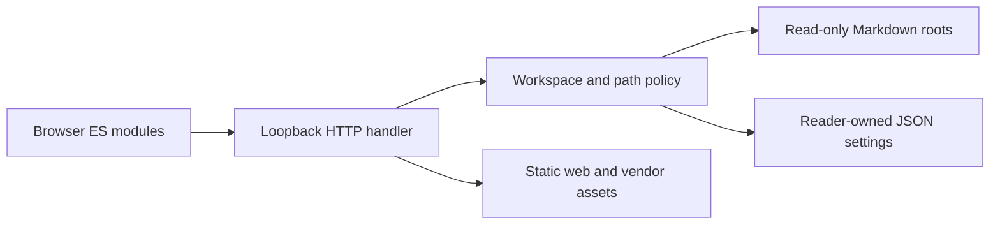
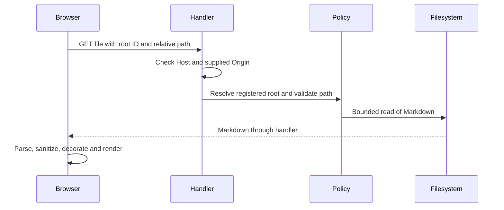

# Architecture

## Implemented: overview

One loopback Python HTTP process serves a static browser application and read-only Markdown APIs. The browser renders sanitized HTML and keeps preferences in localStorage. Reader settings persist registered paths separately from documents. There is no database, hosted service, build pipeline or document-write API.

Caption: implemented component boundaries. Legend: solid arrows are implemented calls; only the settings arrow permits writes.

Caption: implemented document request flow. Legend: solid calls and dashed responses describe existing behaviour, not future components.

## Implemented: responsibilities and technology

| Component | Responsibility / choice | Trade-off |
| --- | --- | --- |
| [HTTP](../server/http.py) | stdlib HTTP routing, exact request guards, explicit static MIME types | Suitable for a trusted local reader, not a production Internet server |
| [Policy](../server/policy.py) | canonical boundaries, caps, root state and settings | Path resolution is not race-proof against a malicious local filesystem actor |
| [Entry point](../server/__main__.py) | CLI roots/port and environment-selected settings | A startup root is an intentional filesystem capability |
| [State](../web/state.js), [workspace](../web/workspace.js) | browser preference storage and picker lifecycle | No shared account or synchronization |
| [Tree](../web/tree.js), [search](../web/search.js) | folder rendering and asynchronous search | No natural-sort controls or contextual search tree |
| [Rendering](../web/rendering.js), [paths](../web/paths.js) | marked, DOMPurify, highlight.js and local link/slug handling | Preserved renderer limitations and pinned older vendor versions |
| [Navigation](../web/navigation.js), [theme](../web/theme.js) | keyboard, hash navigation, theme, font, print | Section positions are not restored |
| [Configuration](../web/config.js) | one display-name/storage-prefix source | Documentation titles remain static text |
| [Tests](../tests/test_server.py) | unittest and node:test without dependencies | Real-browser layout and clipboard/print behaviour require browser verification |

## Implemented: threat model

Assets: displayed Markdown contents, local directory metadata, reader settings and browser execution context. Actors: the local user, a remote site attempting cross-origin/rebinding requests, malicious Markdown, and local processes. Trust boundaries: HTTP request to handler, root-relative path to filesystem, Markdown to DOM, and reader-owned settings to source documents.

| Invariant / mitigation | Regression evidence |
| --- | --- |
| Bind only to IPv4 loopback | `ServerTests.test_loopback_binding` in [server tests](../tests/test_server.py) |
| Reject unapproved Host and supplied Origin; require Origin for writes | `test_host_and_origin_matrix`, `test_duplicate_headers_rejected` |
| Reject absolute/traversing paths and non-public static files | `test_paths_and_static_boundary` |
| Reject symlink and skipped-folder reads consistently | `test_symlink_and_skipped_paths` |
| Bound Markdown and request-body reads, results and browse listings | `test_file_size_boundary_and_search`, `test_bad_request_bodies`, `test_search_and_file_caps`, `test_browse_and_registration_boundaries` |
| Enforce resolved home/startup boundaries; saved state cannot expand them | `test_browse_and_registration_boundaries`, `test_persistence_cannot_expand_boundaries` |
| Never write displayed source documents | `test_documents_remain_unchanged` |
| Treat prototype-shaped names as data; escape search output | [logic tests](../tests/logic.test.js): prototype and highlighting cases |
| Namespace preferences and tolerate inaccessible browser storage | [logic tests](../tests/logic.test.js): storage case |

Markdown sanitization occurs immediately before DOM insertion. Browser checks exercise hostile synthetic markup; this is not a proof against all sanitizer bypasses. Remote/data images retain the existing treatment; remote images can disclose network metadata. Local image references remain placeholders.

Residual risks: broad home enumeration by a trusted same-origin client, concurrent filesystem replacement between validation and open, concurrent settings mutations, slow/large directory traversal, and up to 5,000 bounded file reads per search. Caps limit returned counts and individual bytes, not total execution time or memory in directory enumeration. The HTTP server is not hardened for exposure beyond loopback. Local processes can impersonate HTTP headers and are outside the remote-site protection model.

## Planned / rejected

GET requests explicitly marked `Sec-Fetch-Site: cross-site` are rejected as defence in depth (`test_fetch_metadata`). Missing metadata remains valid for local clients. `same-site` can include unrelated applications on other localhost ports, so Host and Origin remain the primary guards, not Fetch Metadata. Static suffix filtering, nosniff responses and failed-settings-save rollback are pinned by `test_static_suffix_whitelist`, `test_nosniff_responses` and `test_settings_save_failure_rolls_back_registration`.

Dedicated diagram/image rendering and layout corrections are planned but not implemented. See [known issues](known-rendering-issues.md). A framework, bundler, database and document editing are rejected for this baseline scope. No future component is shown as implemented in the diagrams.
