# Your first ten minutes with Passage

Start with the [quick start](../README.md). This tutorial uses only bundled synthetic examples, never your own documents until the last step. Instructions live here rather than inside the example collection so they remain readable on GitHub without altering the documents used by rendering tests. Desktop screenshots are 1200×800; the drawer view is 390×800. [Watch the captioned tour](media/passage-demo.mp4).

## 1. Open the examples

Run `python3 -m server` from the checkout (Windows: `py -m server`), then open the printed address. Files shows the example collection. Select **A place for careful reading** (`reading-guide.md`). You should see prose, a diagram and a small checklist; the source stays unchanged.

## 2. Browse, filter and jump

Choose Files on the rail, type `plan` in **Filter files**, and notice that matching titles/filenames remain. Clear the filter. Press **Ctrl+P** (Mac: **Cmd+P**), type `reading-guide`, use the arrow keys to select it and press Enter. Quick open should take you directly there; Escape cancels it.

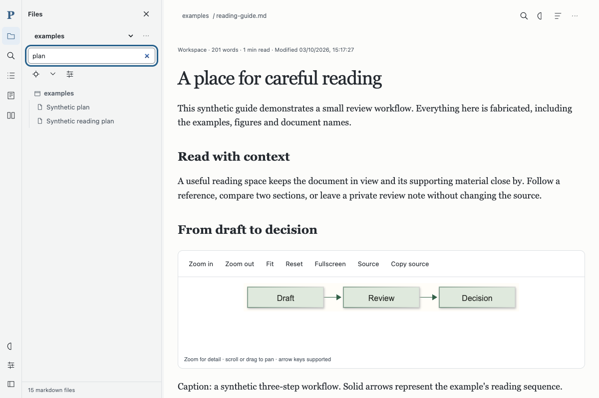

## 3. Search inside documents

Choose Search on the rail. Expand **Search options**, leave scope at Workspace and type `synthetic`. Results include matching passages; choose a result to open it. Exact phrase, case and whole-word options change matching; the status reports scanned files and truncation. **Back to results** retains your query.

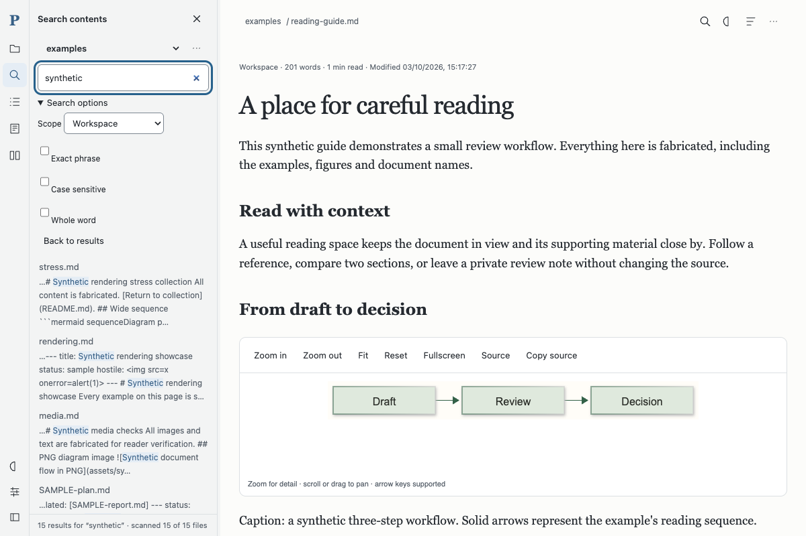

## 4. Follow a link and return

Return to the guide using Quick open. Scroll to **Continue exploring** and choose **synthetic plan**. The destination opens and a return Trail appears in the header. Focus the reading pane and press **Alt+Left**, or use its Back to… control. You should return to the same passage in the guide, not just its top.

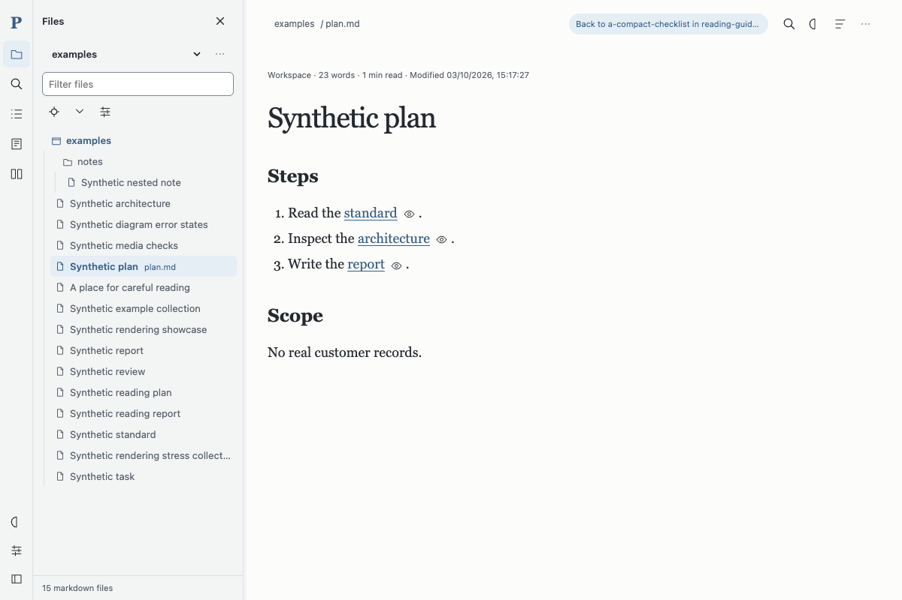

## 5. Peek without leaving

Beside the guide's plan link, choose the small eye icon (tooltip **Peek synthetic plan**). A preview opens without changing your current document. **Return** or Escape closes it; **Open here** visits the target. This is a resource-free section preview rather than a second full renderer.

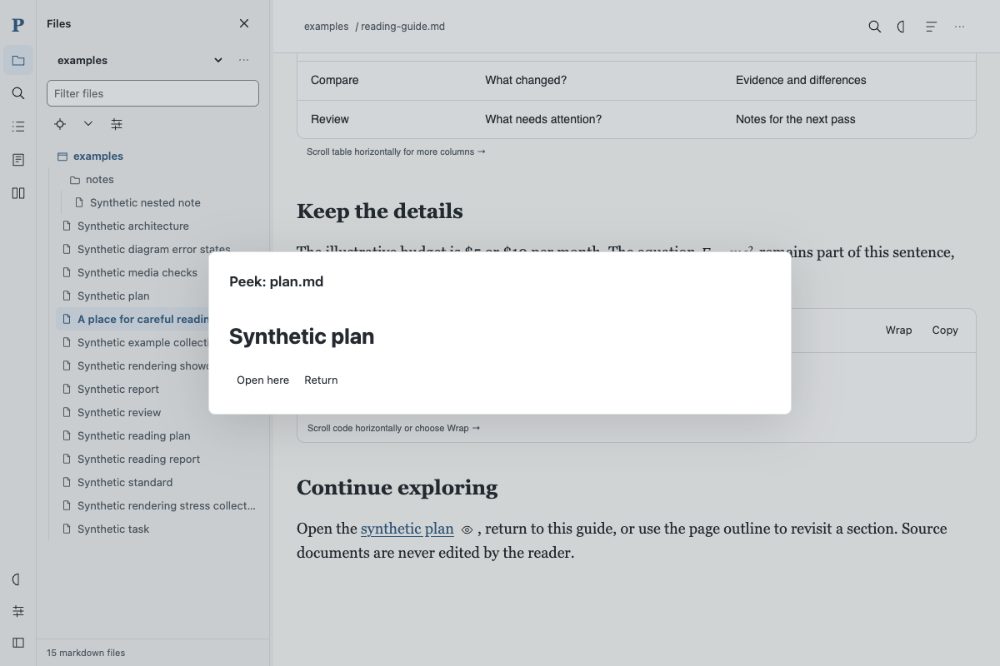

## 6. Inspect a diagram

Scroll to **From draft to decision**. Choose **Zoom in**, then **Fit** to restore the diagram to its frame. Focus its viewport and use arrows to pan. **Source** reveals its definition; **Fullscreen** enlarges the view. The reader supports flowchart, sequence and ER diagrams, not every diagram grammar.

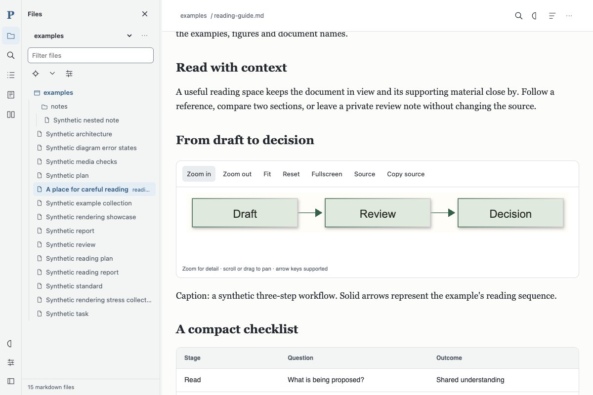

## 7. Compare related documents

Choose Compare on the rail. Set the left document to `SAMPLE-plan.md`, right to `SAMPLE-report.md`, then choose **Compare selected**. Wait for **Aligned**. Select the Evidence section; both sides follow matching headings. This aligns reading positions, not semantic text changes. Close the comparison to return.

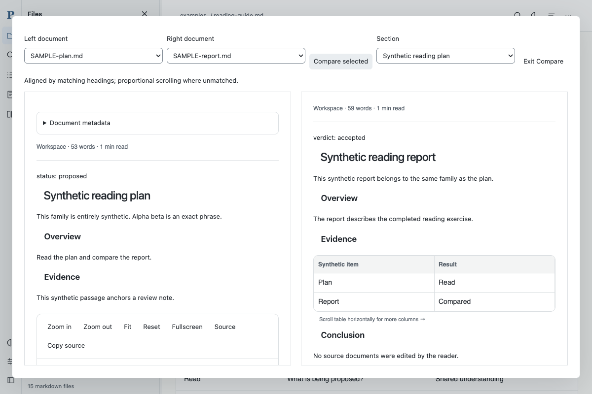

## 8. Keep a note and a reading list

Open `SAMPLE-plan.md`, scroll to Evidence, then choose Notes. Enter “Synthetic review: confirm the evidence before approval.” and **Save note**. Your note should appear with its passage reference. Select its checkbox and **Export selected notes**; a text export opens for copying. Close it.

Choose Lists, enter `Synthetic review`, **Create list**, then **Add current section**. The reference appears in your list. These records belong to the reader, not the Markdown source. Shared settings support one server process; don't run competing writers.

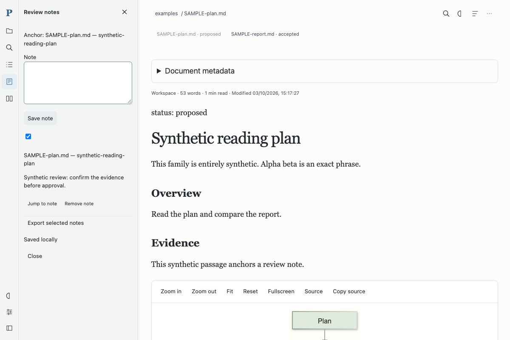

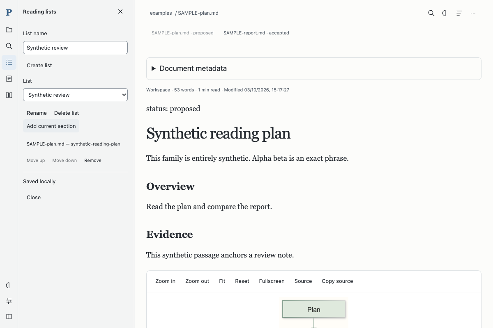

## 9. Adjust Appearance and Focus

Choose Appearance (half-circle icon). Select Dark, Light or Auto. Fill window is on by default; turn it off to reveal **Maximum line length**. Choose Focus to hide side panels. Move to the top edge to reveal page controls; Escape or Exit focus restores the shell. Preferences survive reload; Reset restores defaults.

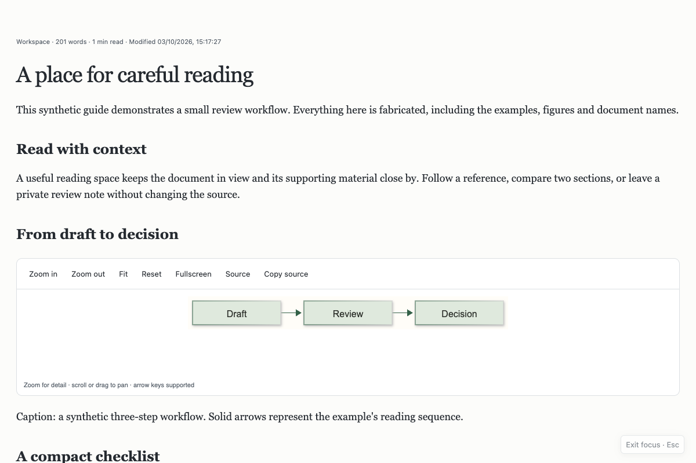

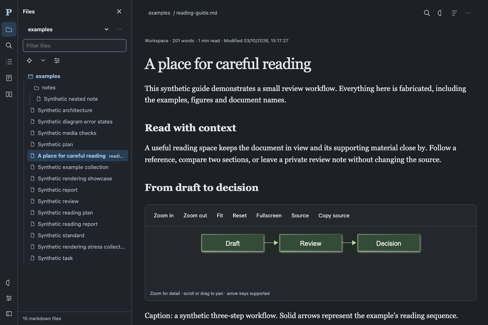

## 10. Add your own folder

Choose Files, then the workspace **… → Add folder** menu. Browse to a trusted document folder and choose **Add this folder** when enabled. Alternatively restart with `python3 -m server --root "/path/to/documents"`. Keep reader settings outside that folder; folders enclosing settings cannot be registered. No documents are copied or modified. To remove a registration, use **Remove folder**; this never deletes the files.

On narrow windows, the bottom-left menu opens the section drawer; close it for unobstructed reading.

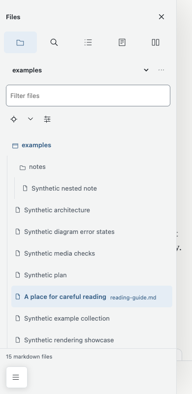

Next: [keyboard map](reference.md#keyboard-map), [full reference and limitations](reference.md), [security](../SECURITY.md).
