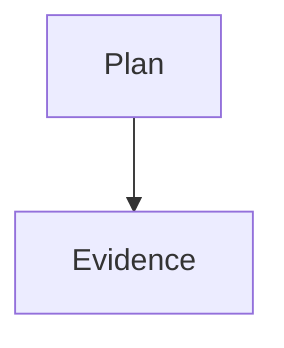

status: proposed

# Synthetic reading plan

This family is entirely synthetic. Alpha beta is an exact phrase.

## Overview

Read the plan and compare the report.

## Evidence

This synthetic passage anchors a review note.

## Conclusion

The reading exercise is synthetic.
