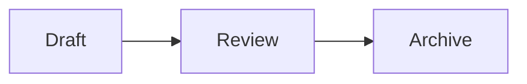
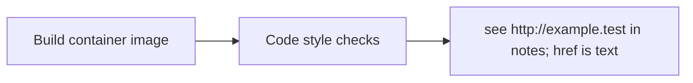
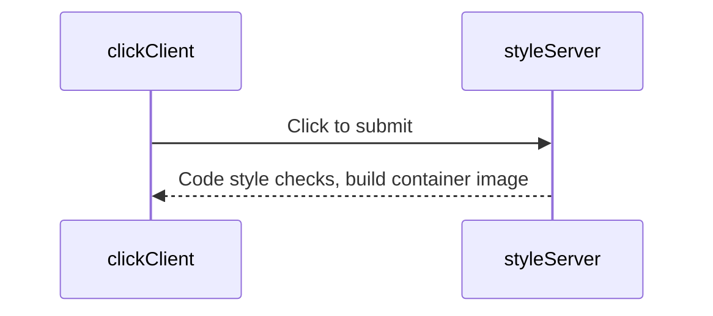
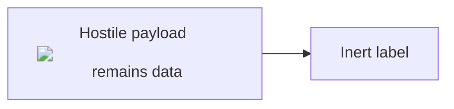

# Synthetic architecture

## Flow

## Components

| Component | Purpose |
| --- | --- |
| Draft | Fabricated text |
| Review | Synthetic check |

Return to the [plan](plan.md).

## Ordinary label words

## Inert label content

This fabricated label is data, not an instruction to execute HTML.

