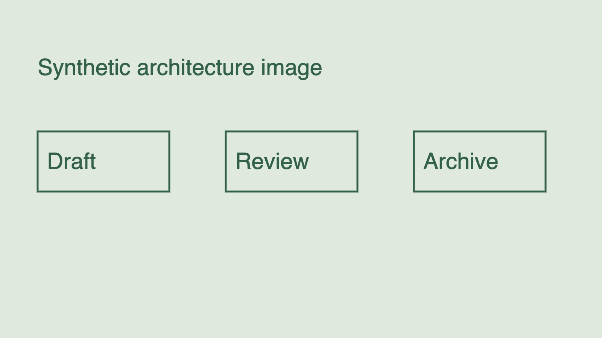
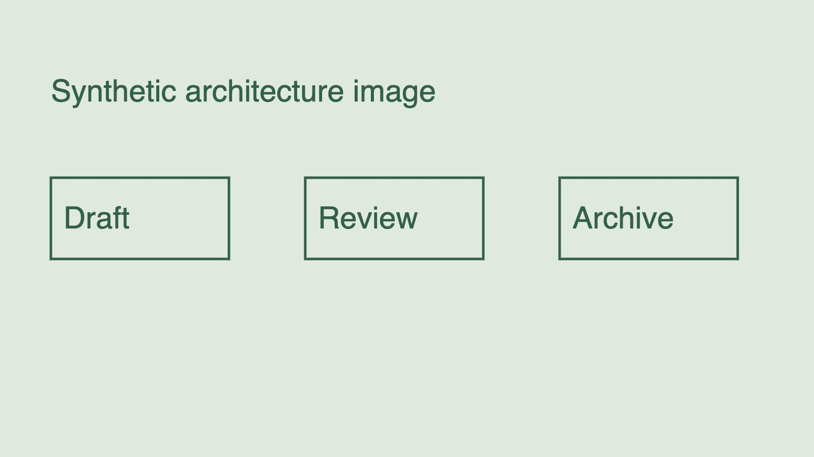
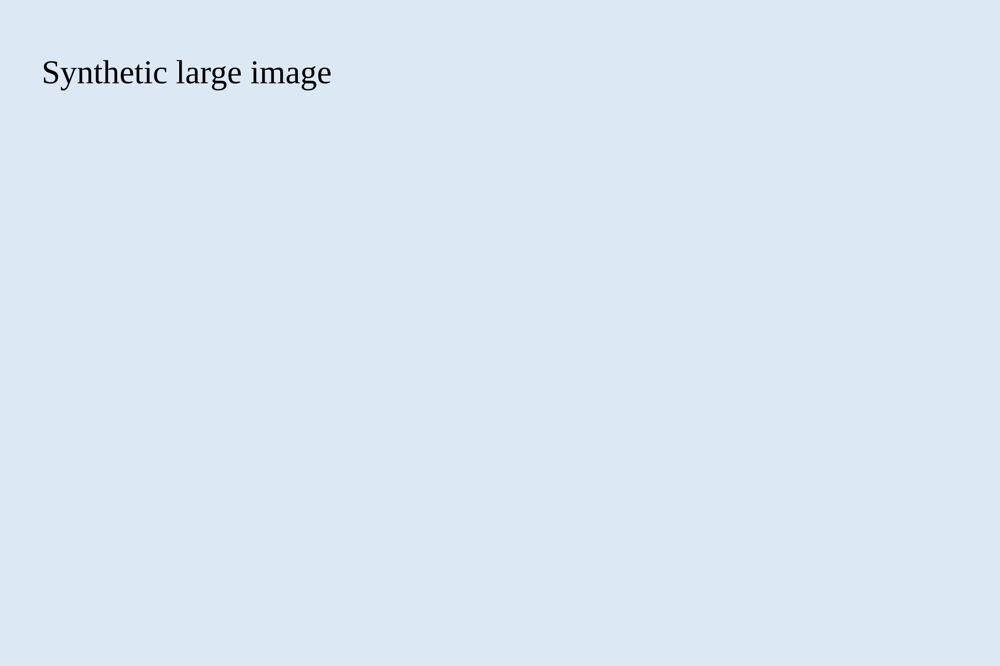

# Synthetic media checks

All images and text are fabricated for reader verification.

## PNG diagram image

## JPEG diagram image

## Unsupported vector

## Missing file

## Return

Return to the [collection](README.md).
