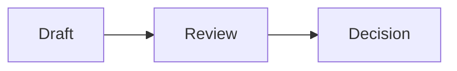

# A place for careful reading

This synthetic guide demonstrates a small review workflow. Everything here is fabricated, including the examples, figures and document names.

## Read with context

A useful reading space keeps the document in view and its supporting material close by. Follow a reference, compare two sections, or leave a private review note without changing the source.

## From draft to decision



Caption: a synthetic three-step workflow. Solid arrows represent the example's reading sequence.

## A compact checklist

| Stage | Question | Outcome |
| --- | --- | --- |
| Read | What is being proposed? | Shared understanding |
| Compare | What changed? | Evidence and differences |
| Review | What needs attention? | Notes for the next pass |

## Keep the details

The illustrative budget is $5 or $10 per month. The equation $E=mc^2$ remains part of this sentence, without interrupting its rhythm.

```python
def review(document):
    return {"title": document.title, "status": "ready"}
```

## Continue exploring

Open the [synthetic plan](plan.md), return to this guide, or use the page outline to revisit a section. Source documents are never edited by the reader.
